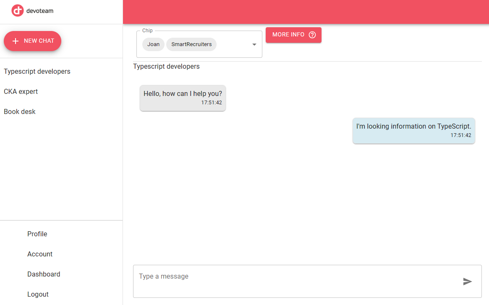

# Infini Connect UI

## Overview

GenOp AI Chat Interface is a responsive web application built with React, Material UI, and TypeScript. It provides a
seamless user experience for interacting with various AI-driven chat plugins.

## Features

- **Chat History**: View a list of previous chats and continue conversations.
- **Active Chat Display**: Select a chat from the list to display it in the right panel.
- **Responsive Design**: Optimized for various screen sizes and devices.
- **Plugin Selection**: Use a multi-select box to choose plugins for new chats.

## Screenshots




## Getting Started

### Prerequisites

- Node.js
- npm or yarn

### Installation

1. Clone the repository
   ```shell
   git clone [your-repo-link]
   ```
2. Install dependencies
   ```shell
   npm install
   # or
   yarn install
   ```
3. Run the application
   ```shell
   npm start
   # or
   yarn start
   ```

## Usage

After starting the app, select a chat from the left-hand panel to view it in the right panel. For new chats, use the multi-select box to choose relevant plugins.

## Contributing

Contributions are welcome! Please read our contributing guidelines and submit your pull requests.

## License

Distributed under the MIT License. See LICENSE for more information.

## Contact

Your Name - hardik.patel@devoteam.com

Project Link: https://github.com/orgs/DevoteamNL/projects/61

## Acknowledgments

- Material UI
- React
- TypeScript
